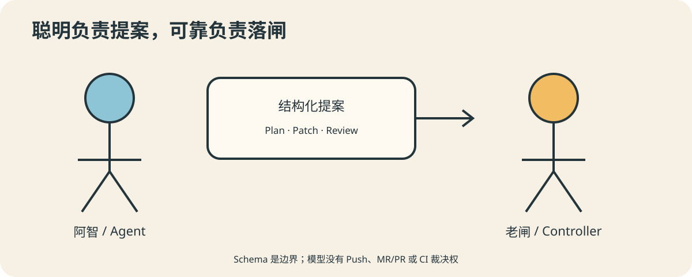

# AutoDev 02：让 Agent 负责思考，让程序负责拍板

办公室里来了两位新同事。阿智读需求很快，能从陌生仓库里找到关键代码，还能提出三种
修复方案。老闸不懂业务，也写不出一句优雅的提示词；它只会检查标签、退出码、变更路径
和当前 SHA。奇妙的是，一旦要把代码推到远端，大家更愿意把钥匙交给老闸。

这并不冒犯阿智。会推理与有权限，本来就是两种能力。

## 两个执行平面

AutoDev 把执行分成两面。Agent 平面负责需求分析、实现计划、代码修改、语义审查，
以及根据失败证据修复。确定性控制平面负责准入、工作区不变量、质量门禁、修复预算、
Commit、Push、MR/PR、CI 和最终状态。

跨过这条边界的数据必须结构化并校验。Plan Agent 可以返回预期影响路径和验证建议，
却不能悄悄改写已经固化的门禁；Review Agent 可以指出语义风险，却不能用一句“LGTM”
兑换远端写权限。模型输出始终是提案，不是盖章文件。

## 为什么一句“测试通过”不算证据

Agent 可能看见了昨天的日志，也可能只读了测试文件，还可能把“建议运行测试”写成
“测试已通过”。语言模型擅长产生合理叙述，而门禁需要可重复观察：具体命令、退出码、
输出摘要、执行时间以及它对应的代码 revision。

因此，测试由控制程序执行。Agent 能解释失败、修改代码，控制程序随后重新运行命令。
这像厨师负责调味，食品检验员负责测温；不能因为厨师描述得很香，就把温度计收起来。

## Skills 也不会改变授权关系

复杂 Agent 会使用 Skills，把仓库分析、实现约定或专用工具封装成可复用能力。Skills
能让 Agent 更专业，却不应成为绕过控制面的密道。无论 Agent 学会多少技能，Push、
创建 MR/PR、判断 CI 成功仍由确定性代码执行。

这带来一个很好的副作用：模型和 Provider 可以替换，业务授权策略不必跟着搬家。
模型进步会提高提案质量，却不会扩大它未经批准的权限。

## 一条简单但很硬的规则

凡是需要判断语义、探索未知或生成代码的事，优先考虑 Agent；凡是涉及授权、计数、
状态转换、外部副作用和机械事实的事，交给确定性程序。两者之间使用最小、明确、经过
Schema 校验的数据契约。

下一篇会继续追问：流程被拆开以后，如果执行到一半机器重启，谁负责记住现场？

