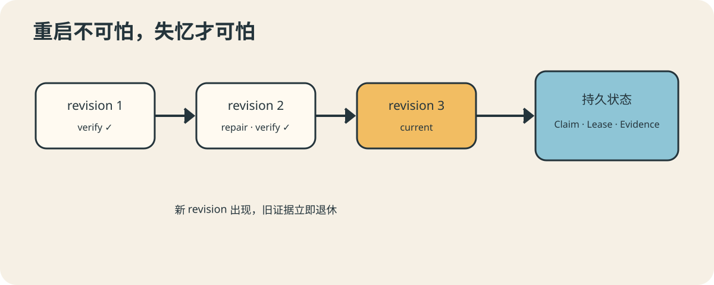

# AutoDev 03：一条长工作流怎样记住自己走到哪里

凌晨两点，AutoDev 已经完成实现和本地测试，正准备审查。此时进程重启了。第二天它
醒来，面临三个选择：从头再来、假装已经完成，或者翻开昨晚留下的可靠记录。

前两个选择都很有戏剧效果，也都不适合生产系统。

## 阶段不是进度条上的装饰

AutoDev 把工作流拆成 intake、workspace、plan、gates、implement、verify、review、
publish、ci 和 report。每一阶段都有明确输入、输出、允许的副作用和失败语义。

持久状态会记录任务走到了哪里，但状态名本身还不够。“locally_verified”必须能回答：
验证的是哪一版代码？运行了哪些命令？证据是否脱敏？后来有没有再次修改？否则它只是一
张写着“放心”的便利贴。

## Revision：给每轮代码一张身份证

每次实现或修复都会产生新的 revision。验证、审查、发布、Push SHA 和 CI 都绑定到
该 revision。revision N+1 出现以后，revision N 的绿灯全部失效。

这是很容易被忽略的严谨：CI 的确成功过，但成功的是旧代码；审批的确给过，但批准的是
修复前的变更。AutoDev 不和“差不多还是那份代码”讲人情。

## 幂等不是“多试几次”

长流程一定会重试。远端副作用在执行 Create 前先观察：分支是否已推送、Draft MR/PR
是否存在、Issue 评论是否已有对应标记。若动作已经完成，就采用已有结果；若远端状态与
记录冲突，则停下来，而不是用更大的力气再推一次。

本地状态通过原子写入保存，事件先 Claim，仓库再取得 Lease。Claim 防止同一事件被
消费两次，Lease 防止不同入口同时改一个仓库。Scheduler 的并发策略是第一道门，仓库
租约是防御纵深——腰带和背带同时存在，不代表裤子缺乏自信。

## 恢复规则必须早于故障

每个副作用都应幂等，或者拥有写在代码与契约里的恢复规则。不能等事故发生再讨论
“理论上那次 Push 应该成功了吧”。AutoDev 会重新观察 Workspace、远端任务分支、
MR/PR 和精确 SHA，而不是只相信本地的一句历史记录。

下一篇，我们沿着流程回到最前面：一个外部 Webhook 到底要经过几道门，才有资格成为
内部任务。

