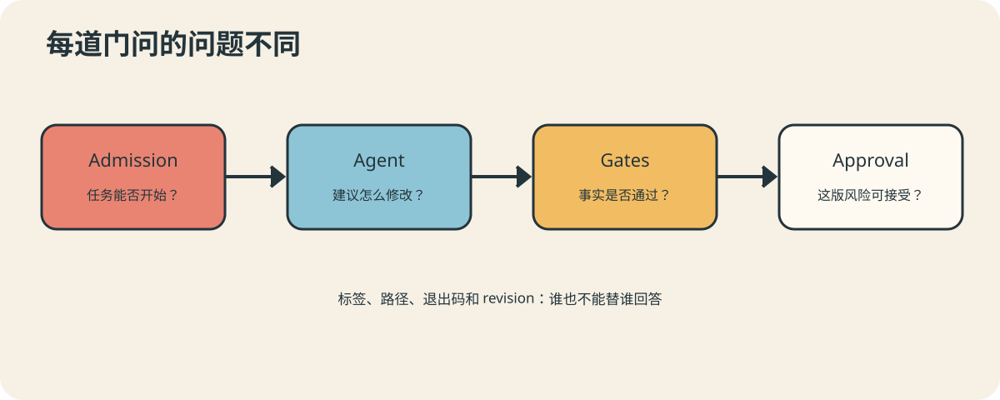

# AutoDev 06：模型说“没问题”，门禁说“请出示证件”

阿智完成代码后写了一份热情洋溢的总结：实现优雅、兼容旧接口、测试充分、值得立即发布。
老闸读完点点头，然后问：“退出码呢？”

气氛一度像年终述职遇上财务审计。但对自动化系统来说，这是健康的尴尬。

## Admission 决定能不能开始

准入策略检查 Provider、仓库 Allowlist、事件动作、必需标签、Issue 作者和事件操作者，
同时排除冲突任务与重复事件。它发生在 Agent 大规模读取与修改之前，避免把算力和权限
花在本不该接受的任务上。

AutoDev 支持 `plan-only`、`no-push` 和 `draft` 等模式。模式不是 Prompt 里的语气，
而是控制程序真正执行的能力边界：只计划、只做本地验证，或允许创建 Draft MR/PR。

## Gates 决定能不能继续

门禁由全局安全默认值、项目仓库策略、Plan 识别的影响路径和实际 changed paths 合并。
Plan 能提出预期，却不能降低规则；实际修改若触碰额外路径，还会追加对应检查。

门禁包括测试、类型检查、Lint、构建，也包括禁止路径、敏感信息、文件数量与大小限制。
命令必须由程序真实执行并记录退出码。模型可以建议跑哪项测试，但不能提交一张自己签字
的免检证明。

## 高风险路径需要具体批准

涉及认证、权限、部署或其他高风险路径时，系统可进入 `needs_human`。人工批准绑定具体
revision；后续任何修复产生新 revision，旧批准随之失效。批准的是一份确定的变更，不是
给任务永久发放“以后都行”会员卡。

Policy 保持 Provider-neutral，Gate 保持确定性。这样更换 GitHub/GitLab 或模型不会
改变组织的安全标准，策略也能脱离 Agent 单独测试。

下一篇，门禁终于放行。但从本地绿灯到远端 CI 绿灯，中间还有一段最容易过度乐观的路。

