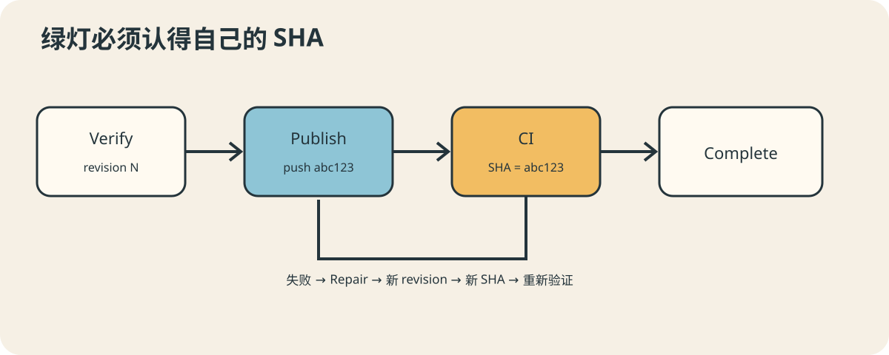

# AutoDev 07：代码写完以后，自动化才刚刚开始

很多演示在 Agent 写完代码时奏响胜利音乐。真实工程通常在这里关掉音乐，打开 CI 页面。
因为“文件已经改了”距离“团队收到一份可信变更提案”，中间还隔着 Review、Commit、
Push、MR/PR、Pipeline，以及一只总能在最后三分钟发现格式问题的 Linter。

## 发布前，再把事实对一遍

Verify 阶段运行固化门禁并保存脱敏证据；Review Agent 检查语义风险，控制程序再结合
规则决定是否放行。Publish 阶段确认当前 revision、工作树、提交内容和远端分支状态，
随后才 Commit、Push，并创建或更新 Draft MR/PR。

所有远端 Create 都先查找已有对象。重试时复用已有分支和 MR/PR，而不是在项目里留下
`AI change`、`AI change 2`、`AI change final really` 三胞胎。

## CI 成功必须回答“哪一版”

AutoDev 观察与当前 Push SHA 精确匹配的 GitLab Pipeline 或 GitHub Actions。分支上
曾经有过绿色 CI 不够，MR 页面此刻看起来绿色也不够；只有当前 revision 对应的 pushed
SHA 成功，才能满足门禁。

这是 revision 逻辑在远端的延伸。每次 Repair 都修改本地代码、产生新 revision、重新
验证并发布新的 SHA。旧 Pipeline 即使姗姗来迟地变绿，也不能替新代码毕业。

## 修复要有预算，也要知道何时停

本地或 CI 失败证据经过裁剪和脱敏后交给 Repair Agent。修复轮数、时间和证据大小都有
上限；预算耗尽、需求不明确或风险过高时，工作流转入明确终态并交给人，而不是无限循环
到宇宙热寂。

AutoDev 默认只创建 Draft MR/PR，不自动 Merge，也不自动 Deploy。自动化负责把变更
提案送到可审查的位置，不趁大家午休时悄悄成为发布经理。

下一篇，我们把整套运行环境装进镜像，看看复杂 Agent 如何获得一致、可搬运的工具箱。

