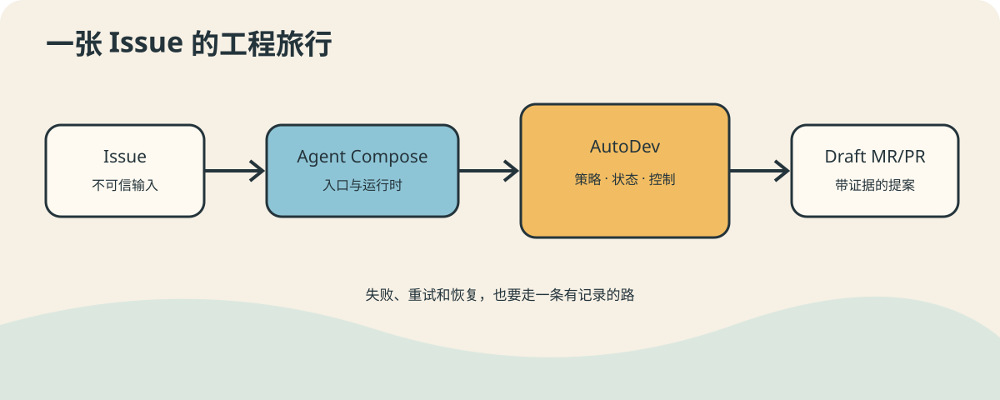

# Agent Compose 工程连载：AutoDev 篇

前四个示例里，我们见过会接待访客的 Agent、临时组建的事故小队、通过事件交接的
三位同事，以及被四个闹钟轮流叫醒的值班员。它们像四则干净利落的小故事：一个
`agent-compose.yml`，少量 JavaScript，问题就有了漂亮的答案。

然后 AutoDev 推门进来了。它身后跟着 Webhook、Git 分支、策略、状态机、CI、
凭据、修复预算和一沓写着“重试时怎么办”的表格。会议室突然显得有点小。

这组文章不把 AutoDev 包装成一个无所不能的超级 Agent。恰恰相反，它要讨论的
是：当 Agent 真正进入复杂工程，我们怎样限制它的权力、保存它的工作、验证它的
结论，并让整个系统在半夜重启后还记得自己做到哪一步。

## 阅读地图

如果希望一次读完整个故事，可以直接阅读
[《当 Agent 开始接手一个项目：AutoDev 的复杂工程实验》](forum-edition.md)。这是为公司
论坛整理的单篇合刊版，保留全部插图，并压缩了十篇之间重复的背景说明。

1. [当一个 Agent 不再是一段脚本](01-from-agent-to-system.md)  
   从简单示例跨进复杂工程，先把平台和业务边界画清楚。
2. [让 Agent 负责思考，让程序负责拍板](02-two-planes.md)  
   为什么“建议发布”和“执行发布”必须是两回事。
3. [一条长工作流怎样记住自己走到哪里](03-durable-workflow.md)  
   阶段、revision、幂等、租约和恢复。
4. [同一扇门，接住 GitHub 和 GitLab](04-event-ingress.md)  
   Webhook 鉴权、Payload 归一化和业务准入。
5. [给 Agent 一间工作室，但不给仓库总钥匙](05-safe-workspace.md)  
   Sandbox、Git Workspace 和发布权限的边界。
6. [模型说“没问题”，门禁说“请出示证件”](06-policy-and-gates.md)  
   用策略与机械证据约束概率性输出。
7. [代码写完以后，自动化才刚刚开始](07-publish-and-ci.md)  
   Commit、Push、Draft MR/PR、精确 SHA CI 与有限修复。
8. [给复杂 Agent 装一只可以搬走的行李箱](08-runtime-image.md)  
   构建 Guest Image，安放代码、工具、配置、Secret 和状态。
9. [系统失败时，别只留下一句“它不行了”](09-observability-and-testing.md)  
   证据、脱敏、测试与可追问的失败。
10. [从会做事的 Agent 到可运行的工程](10-methodology.md)  
    把 AutoDev 的选择收束成一套可迁移的方法。

## 这组文章刻意不做什么

它暂时不提供逐条命令的上手演练。AutoDev 是后台控制程序，没有值得拍十张截图的
按钮；若为了“图文并茂”硬给它画一套驾驶舱，多少有点给配电箱安装美颜灯。

这里的图用于解释职责、状态和证据流向。真正部署时，请以项目的
[README](../../README.md)、[工作流契约](../architecture/workflow.md)和
[职责边界](../architecture/responsibility-boundary.md)为准。
